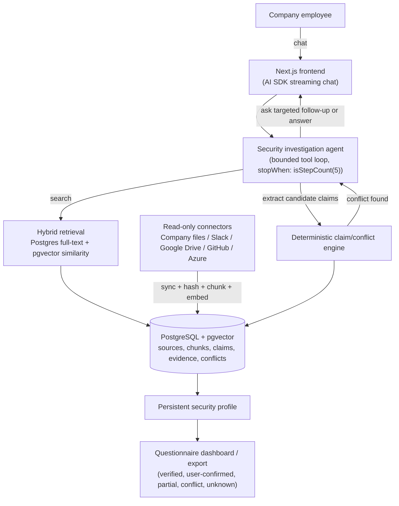

# Agenticbill: AI Security Analyst

Built for the **RegoDIT Hackathon, Risk & Compliance track ("AI Security Analyst")**.

## Problem Statement

When a startup goes through enterprise sales, the customer sends over a security
questionnaire: MFA, data storage, encryption, backups, vulnerability scans,
production access, offboarding, background checks, and dozens more. The answers
exist, but they're scattered across policies, infrastructure notes, internal
messages, and people's heads: incomplete, ambiguous, and sometimes contradictory.

**Agenticbill is an AI Security Analyst**: a chatbot that talks to a company
employee, searches company information *before* asking anything, asks smart
follow-up questions instead of accepting vague answers, detects and surfaces
contradictions instead of guessing, remembers what it learns across the
conversation, and, once enough is known, generates a completed security
questionnaire that clearly separates:

- **Verified**: confirmed from company documents, with evidence
- **User-confirmed**: stated by an employee, with no documentary evidence
- **Partial**: some but not all required details are known
- **Conflict**: contradictory evidence found, not yet resolved
- **Unknown**: no evidence and no confirmation yet

The golden rule: **never invent an answer.** A policy is not proof of
implementation. If it's not known, ask. If it conflicts, investigate. If it's
still unknown, mark it unknown.

## Tech Stack

- **Next.js 16 (App Router) + Vercel AI SDK**: chat UI, streaming, tool-calling
  agent loop (forked from the [Vercel AI Chatbot](https://chatbot.ai-sdk.dev) template)
- **PostgreSQL + pgvector**: single system of record for sources, chunks,
  claims, evidence, and conflicts; hybrid retrieval (Postgres full-text search
  plus pgvector cosine similarity)
- **Azure OpenAI** for chat and embeddings when a deployment is configured,
  with the **Vercel AI Gateway** as the fallback provider otherwise. No
  dependency on Azure AI Search.
- **Auth.js guest sessions**: single-workspace, no visible login, just enough
  identity to scope data
- **Read-only connectors** for company knowledge: company file uploads,
  Slack, Google Drive (OAuth), and GitHub, each reporting its own status
  (`ready`, `demo`, or `needs_setup`) so the assistant is honest about what's
  actually wired up versus still seeded from fixtures
- **Tavily** (optional): public/vendor research only; private company data
  never leaves the private ingestion path
- **shadcn/ui + Tailwind**: chat UI, security dashboard, evidence cards,
  conflict alerts

### Deliberate non-choices

- **AI SDK instead of LangGraph**: the product is a bounded investigation
  loop (search, extract claims, compare, detect gaps/conflicts, answer or ask
  one follow-up, save state), which `streamText()` plus tool calling plus
  `stopWhen: isStepCount(5)` already covers. LangGraph is worth revisiting
  later only if the product needs durable checkpointed workflows,
  resume-after-interruption, human-approval steps, or long-running background
  investigations across many systems.
- **No LangChain Deep Agents**: Deep Agents' planning/filesystem
  tools/subagents/long-term memory are built for autonomous delegated tasks;
  this product needs a controlled, auditable evidence workflow instead.
- **Custom RAG instead of a RAG framework/repo**: versioned hashing,
  claim/evidence separation, and conflict detection are specific enough to
  this domain that a generic RAG library would fight us more than help.
- **PostgreSQL + pgvector instead of Azure AI Search**: one database for
  both structured (claims, evidence, questionnaire state) and vector data,
  no second system to keep in sync.
- **Direct read-only connectors instead of a generic connector abstraction**:
  Slack, Google Drive, and GitHub are wired up individually with their own
  auth and sync logic, each falling back to seeded demo data when not
  configured, rather than hiding them behind a speculative common interface
  before there were enough real integrations to know what it should look like.

## Architecture



Text summary of the same pipeline:

```text
Next.js frontend
  -> AI SDK streaming chat
  -> Security investigation tools (bounded tool loop)
  -> Hybrid PostgreSQL/pgvector RAG
  -> SHA-256 versioned source/chunk metadata
  -> Deterministic claim/conflict engine
  -> Persistent security profile
  -> Questionnaire dashboard/export
```

### 1. Ingestion and versioning

Every source (policy, internal message, infrastructure fact, employee record,
user confirmation, or public reference) is canonicalized before hashing:
normalized line endings, trimmed whitespace, sorted JSON keys, volatile
timestamps stripped, so formatting noise never triggers a false "changed"
signal. Three SHA-256 hashes drive re-sync:

- `contentHash`: did the source itself change?
- `metadataHash`: did title/author/scope/effective-dates/reliability change?
- `chunkHash` (content + position): which individual chunks changed, so only
  those get re-embedded

Re-syncing a source falls into one of four cases: nothing changed (skip
entirely), only metadata changed (new source version, embeddings reused),
content changed (re-chunk, diff `chunkHash`, embed only what's new, mark old
chunks non-current), or the source disappeared (mark `isCurrent = false`,
keep for audit history, never hard-deleted).

### 2. Hybrid retrieval

A question triggers Postgres keyword search and pgvector similarity search in
parallel, deduplicated by `chunkHash`, filtered by `workspaceId`,
`isCurrent`, effective date, source type, and scope, and ranked (current,
then newer, then higher reliability, then closer scope match, then higher
relevance) down to the top 5 to 8 chunks. The model only ever sees that
shortlist, never the raw database.

### 3. Claims, not chunks, are the answer

A retrieved chunk is evidence, not an answer. The pipeline is: retrieved
chunks, LLM extracts candidate claims, deterministic code compares claims,
claim is saved with its evidence, questionnaire status is recalculated.

```json
{
  "subject": "mfa",
  "property": "enabled",
  "value": true,
  "scope": "Google Workspace",
  "status": "verified",
  "evidence": ["chunk-123"],
  "confidence": 0.94
}
```

A claim is never `verified` without evidence. An answer from a person with no
document behind it is `user_confirmed`, not `verified`. No evidence and no
confirmation is `unknown`. Two claims about the same subject/property/scope
that disagree are a `conflict`: the assistant explains the contradiction and
asks a targeted question instead of picking a side. Corrections create a new
claim version; they never silently overwrite history.

### 4. Read-only company connectors

Company knowledge reaches the analyst through a small set of read-only
connectors, each reported through a single status list (`ready`, `demo`, or
`needs_setup`) so the UI is honest about what's actually live:

- **Company files**: uploaded policies, questionnaires, CSVs, and
  infrastructure exports
- **Slack**: operational messages, access exceptions, offboarding evidence
  (OAuth-gated)
- **Google Drive**: policies and security documents synced from a connected
  folder, including Word documents (OAuth-gated)
- **GitHub**: repository access, branch protection, and security settings
  (app-connection-gated)
- **Azure infrastructure**: resource, identity, backup, and vulnerability
  evidence (seeded demo inventory until a service principal is configured)

Whichever connector a source came from, everything downstream (chunking,
embedding, claim extraction) only ever sees the same canonical source shape,
so adding a new connector never touches the questionnaire or claim logic.

## Demo Dataset

The real dataset, the Regodit vendor security questionnaire (65 questions
across 14 topics), all 13 company policies, the SOC2 Type II and VAPT
reports, access review records, and the asset inventory, lives under
`chatbot/lib/security/` and is what the analyst is seeded with for the demo.

## Running locally

See [`chatbot/README.md`](./chatbot/README.md) for setup (env vars, database,
`pnpm install && pnpm dev`).
